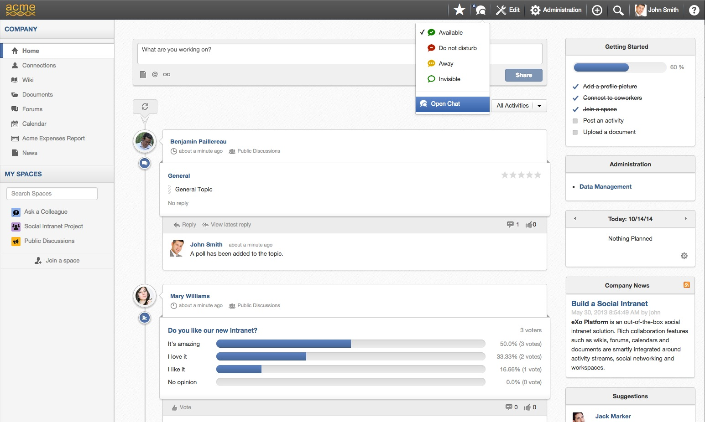
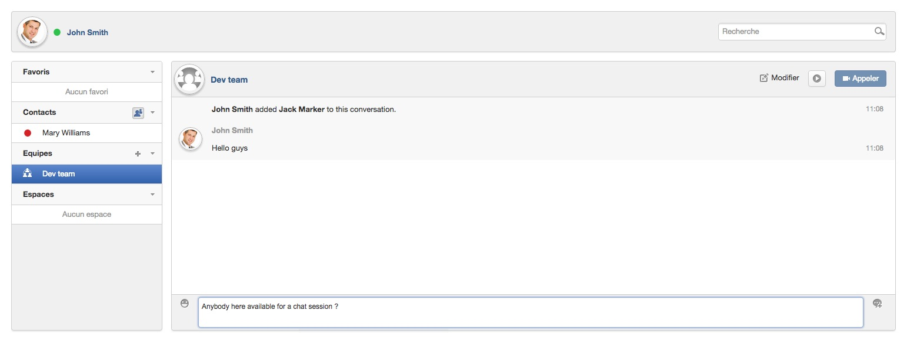

# Ubuntu + Oracle jdk 7 + eXo Platform Community + Chat add-on Docker container

* eXo Chat add-on 1.0.0-RC1
* eXo Platform 4.1-RC1 Community edition
* MongoDB 2.6
* Oracle JDK 7 update 60
* Ubuntu 14.04

## How to

* run the container

    docker run -d -p 8080:8080 --name="exo-chat" exoplatform/ubuntu-jdk7-exo-chat:1.0.0-rc1

* watch container logs to follow the eXo Platform boot progress

    docker logs --follow exo-chat

* enjoy your social intranet at [http://localhost:8080]() ;-)

## Container versions history

### 1.0.0-rc1

* Upgrade eXo Chat add-on to 1.0.0-RC1 with a brand new look!
* Upgrade eXo Platform to 4.1.0-RC1

    docker run -d -p 8080:8080 --name="exo-chat" exoplatform/ubuntu-jdk7-exo-chat:1.0.0-rc1

### 0.9.0

Initial version of the container with the following content:
* eXo Platform 4.1-M2
* eXo Chat add-on 0.9.0

    docker run -d -p 8080:8080 --name="exo-chat" exoplatform/ubuntu-jdk7-exo-chat:0.9.0

## Whish list

* ability to keep data when we upgrade the container
* ability to use an external MongoDB container / server
* ability to use an external MySQL database container / server
* ability to install other add-ons
